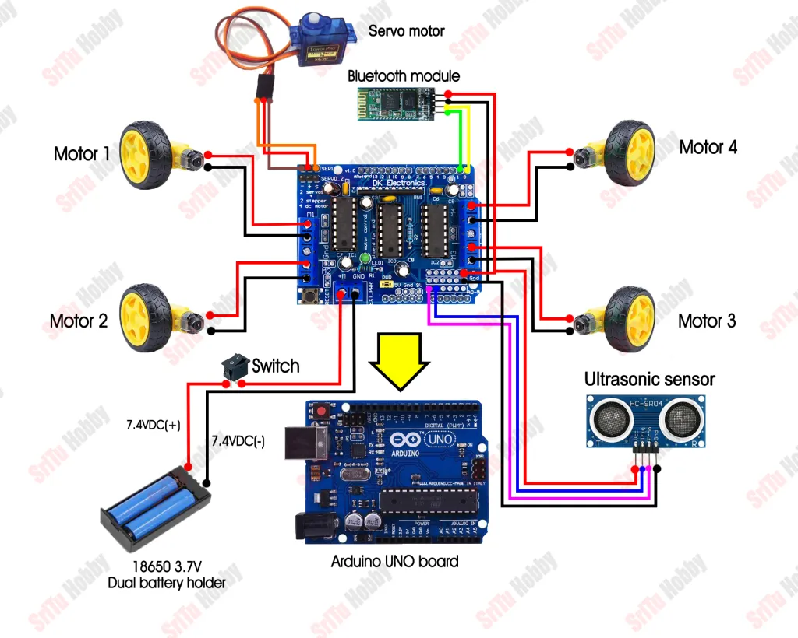
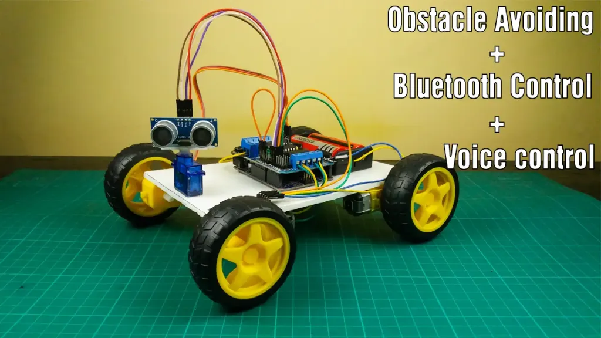

# Bluetooth & Voice Controlled Obstacle Avoiding Car

## Description
This project demonstrates the working of a Bluetooth & voice-controlled robot car that can avoid obstacles. The car uses Bluetooth for remote control and voice commands for navigation. It also uses ultrasonic sensors for obstacle avoidance. The system is based on Arduino, and it's a fun and innovative way to control a robot!

## Components Used
- **Arduino UNO**: Microcontroller for controlling the car.
- **Bluetooth Module (HC-05)**: Allows communication between the car and the mobile device.
- **Ultrasonic Sensor (HC-SR04)**: Measures distance to detect obstacles.
- **DC Motors with L298 Motor Driver**: Powers the motors of the car.
- **Jumper wires, wheels, and chassis**: For assembling the car.
- **Power Supply (Battery)**: Powers the entire setup.

## Key Features
- **Bluetooth Control**: Control the car remotely using Bluetooth.
- **Voice Command Support**: Navigate the car using voice commands.
- **Obstacle Avoidance**: Automatically avoids obstacles using ultrasonic sensors.
- **Real-time Feedback**: Provides real-time control and navigation.

## Installation & Setup
1. **Hardware Setup**:
   - Connect the DC motors to the L298 motor driver.
   - Connect the ultrasonic sensor to Arduino (echo and trigger pins).
   - Wire the Bluetooth module to Arduino (TX and RX pins).
   - Power the Arduino and motors using a suitable battery.

2. **Software Setup**:
   - Download and install the Arduino IDE if not already installed.
   - Open the Arduino IDE and upload the code to your Arduino UNO.

3. **Mobile App Setup**:
   - Install a Bluetooth control app on your mobile (like "Bluetooth Terminal" or any custom app).
   - Pair your mobile device with the HC-05 Bluetooth module.

4. **Run the Robot**:
   - After the setup, the car can be controlled through the Bluetooth or voice commands.



## Source Code:
```cpp
#include <Servo.h>
#include <AFMotor.h>
#define Echo A0
#define Trig A1
#define motor 10
#define Speed 170
#define spoint 103
char value;
int distance;
int Left;
int Right;
int L = 0;
int R = 0;
int L1 = 0;
int R1 = 0;
Servo servo;
AF_DCMotor M1(1);
AF_DCMotor M2(2);
AF_DCMotor M3(3);
AF_DCMotor M4(4);
void setup() {
  Serial.begin(9600);
  pinMode(Trig, OUTPUT);
  pinMode(Echo, INPUT);
  servo.attach(motor);
  M1.setSpeed(Speed);
  M2.setSpeed(Speed);
  M3.setSpeed(Speed);
  M4.setSpeed(Speed);
}
void loop() {
  //Obstacle();
  //Bluetoothcontrol();
  //voicecontrol();
}
void Bluetoothcontrol() {
  if (Serial.available() > 0) {
    value = Serial.read();
    Serial.println(value);
  }
  if (value == 'F') {
    forward();
  } else if (value == 'B') {
    backward();
  } else if (value == 'L') {
    left();
  } else if (value == 'R') {
    right();
  } else if (value == 'S') {
    Stop();
  }
}
void Obstacle() {
  distance = ultrasonic();
  if (distance <= 12) {
    Stop();
    backward();
    delay(100);
    Stop();
    L = leftsee();
    servo.write(spoint);
    delay(800);
    R = rightsee();
    servo.write(spoint);
    if (L < R) {
      right();
      delay(500);
      Stop();
      delay(200);
    } else if (L > R) {
      left();
      delay(500);
      Stop();
      delay(200);
    }
  } else {
    forward();
  }
}
void voicecontrol() {
  if (Serial.available() > 0) {
    value = Serial.read();
    Serial.println(value);
    if (value == '^') {
      forward();
    } else if (value == '-') {
      backward();
    } else if (value == '<') {
      L = leftsee();
      servo.write(spoint);
      if (L >= 10 ) {
        left();
        delay(500);
        Stop();
      } else if (L < 10) {
        Stop();
      }
    } else if (value == '>') {
      R = rightsee();
      servo.write(spoint);
      if (R >= 10 ) {
        right();
        delay(500);
        Stop();
      } else if (R < 10) {
        Stop();
      }
    } else if (value == '*') {
      Stop();
    }
  }
}
// Ultrasonic sensor distance reading function
int ultrasonic() {
  digitalWrite(Trig, LOW);
  delayMicroseconds(4);
  digitalWrite(Trig, HIGH);
  delayMicroseconds(10);
  digitalWrite(Trig, LOW);
  long t = pulseIn(Echo, HIGH);
  long cm = t / 29 / 2; //time convert distance
  return cm;
}
void forward() {
  M1.run(FORWARD);
  M2.run(FORWARD);
  M3.run(FORWARD);
  M4.run(FORWARD);
}
void backward() {
  M1.run(BACKWARD);
  M2.run(BACKWARD);
  M3.run(BACKWARD);
  M4.run(BACKWARD);
}
void right() {
  M1.run(BACKWARD);
  M2.run(BACKWARD);
  M3.run(FORWARD);
  M4.run(FORWARD);
}
void left() {
  M1.run(FORWARD);
  M2.run(FORWARD);
  M3.run(BACKWARD);
  M4.run(BACKWARD);
}
void Stop() {
  M1.run(RELEASE);
  M2.run(RELEASE);
  M3.run(RELEASE);
  M4.run(RELEASE);
}
int rightsee() {
  servo.write(20);
  delay(800);
  Left = ultrasonic();
  return Left;
}
int leftsee() {
  servo.write(180);
  delay(800);
  Right = ultrasonic();
  return Right;
}
```

## Final Setup:


## How It Works:
1. The car moves forward unless the ultrasonic sensor detects an obstacle within a certain range.
2. The Bluetooth and voice commands allow you to control the direction and speed of the car.
3. When an obstacle is detected, the car stops and avoids the obstacle by changing its direction.

## Future Scope:
 - Add more advanced navigation with a maze-solving algorithm.
 - Improve the voice control system with more voice commands.
 - Integrate a camera for real-time video feedback.
